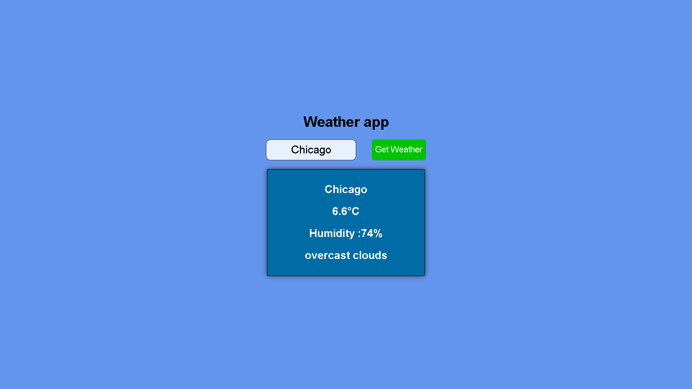

# Weather-app

A weather application that fetches real-time 
weather data using the OpenWeatherMap API.

## Features
- Search any city worldwide 🌍
- Real-time temperature & humidity
- Weather condition & description
- Error handling for invalid cities

## Built With
- HTML
- CSS
- Vanilla JavaScript
- OpenWeatherMap API
- Fetch API

## Preview

## What I Learned
- Fetch API & async/await
- Working with real APIs
- JSON data handling
- Error handling
